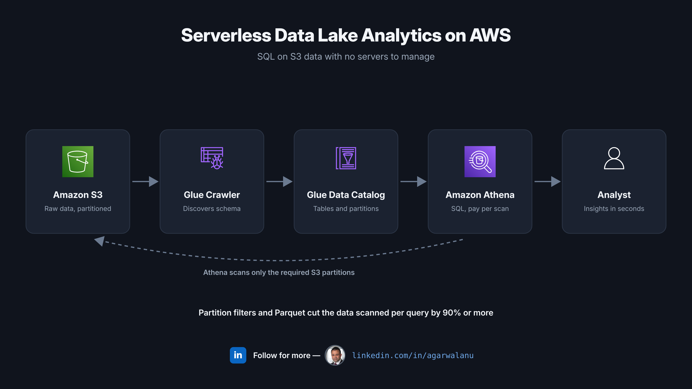
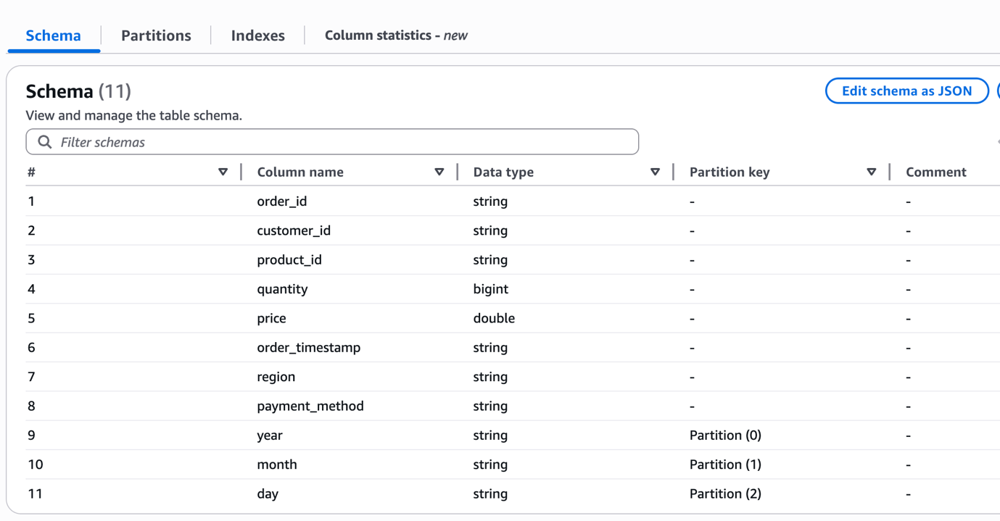
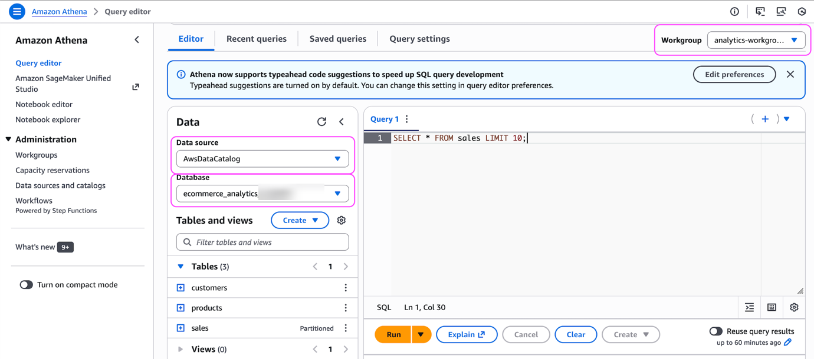
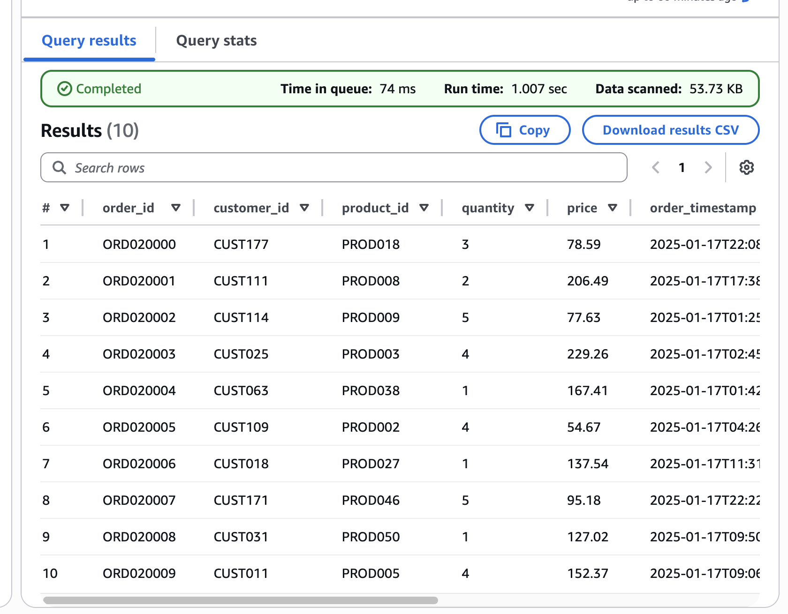

# Serverless Data Lake Analytics on AWS


SQL analytics directly on data in Amazon S3, with no clusters, no ETL servers and no data loading. This project builds a complete serverless data lake for an e-commerce dataset using S3, AWS Glue and Amazon Athena, then measures how partitioning and columnar formats change query cost.

## Architecture



## Services used

| Service | Role in this build |
|---|---|
| Amazon S3 | Data lake storage. Raw CSV datasets under `raw-data/`, with sales data partitioned by `year/month/day`. Also stores Athena query output under `athena-results/` |
| AWS Glue Crawler | Samples the S3 data, infers column names and types, and detects partitions. No manual DDL |
| AWS Glue Data Catalog | Central metadata store. Holds the `sales`, `customers` and `products` table definitions that Athena queries against |
| Amazon Athena | Serverless, Presto-based SQL engine. Reads data in place from S3 and bills per TB scanned |

## The dataset

Three e-commerce datasets stored as CSV in a single S3 bucket:

| Dataset | S3 layout | Contents |
|---|---|---|
| Sales | `raw-data/sales/year=2025/month=01/day=15/` | ~1,000 orders across 3 days: order, customer, product, quantity, price, timestamp, region, payment method |
| Customers | `raw-data/customers/` | 500 customers with loyalty tiers (bronze to platinum) |
| Products | `raw-data/products/` | 300 products across 6 categories, with cost and retail price |

## How it works

1. **Crawl.** The Glue Crawler points at the S3 bucket, samples each dataset and writes table definitions to the Data Catalog. It picked up all 11 sales columns and registered `year`, `month` and `day` as partition keys without any manual schema work.
2. **Catalog.** The Data Catalog now exposes `sales`, `customers` and `products` as queryable tables, each mapped to its S3 location.
3. **Query.** Athena runs standard SQL against those tables, reading the underlying CSV files straight from S3. Joins across all three datasets work exactly as they would in a relational database.
4. **Optimise.** Partition filters and a Parquet copy of the sales table cut the data scanned per query, which is what Athena actually bills for.

Discovered schema for the partitioned sales table:



Athena query editor with the catalogued tables:



First result set: 10 rows returned in about 1 second, scanning 53.73 KB:



## Queries

All queries are in [`queries/analytics.sql`](queries/analytics.sql). Highlights:

**Revenue by region**

```sql
SELECT region,
       COUNT(*) AS order_count,
       ROUND(SUM(quantity * price), 2) AS revenue
FROM sales
GROUP BY region
ORDER BY revenue DESC;
```

**Product profitability across two tables**

```sql
SELECT p.name,
       p.category,
       SUM(s.quantity) AS units_sold,
       ROUND(SUM(s.quantity * s.price), 2) AS revenue,
       ROUND(SUM(s.quantity * (s.price - p.cost_price)), 2) AS profit
FROM sales s
JOIN products p ON s.product_id = p.product_id
GROUP BY p.name, p.category
ORDER BY profit DESC;
```

**Partition pruning**

```sql
-- Scans every file under raw-data/sales/
SELECT * FROM sales
WHERE order_timestamp = '2025-01-15 00:00:00';

-- Scans only the year=2025/month=01/day=15/ prefix
SELECT COUNT(*) FROM sales
WHERE year = '2025' AND month = '01' AND day = '15';
```

**CSV to Parquet with CTAS**

```sql
CREATE TABLE sales_parquet
WITH (format = 'PARQUET') AS
SELECT * FROM sales;
```

## Findings: cost is a design decision

Athena's list price is $5 per TB scanned. Query time does not matter; bytes read do. Three things determined the scan size in this build:

1. **Partition filters.** Filtering on `year`, `month` and `day` makes Athena read only the matching S3 prefixes instead of the whole table. On a 1 TB table, a filter that isolates 10 GB of partitions is a 100x cost reduction for that query.
2. **Columnar format.** The CTAS conversion to Parquet means queries read only the columns they reference, and Parquet's compression shrinks what remains. AWS documents 5 to 10x savings from this change alone.
3. **Query shape.** `SELECT *` on the raw table scans everything. Selecting named columns from the Parquet table scans a small fraction of it.

The practical consequence: two teams can run identical reports on identical data and pay wildly different amounts, purely based on how the lake was laid out. Schema-on-read does not mean design-free.

## Skills demonstrated

- Designing a serverless data lake on S3 with schema-on-read
- Automated schema discovery and partition detection with Glue Crawlers
- Writing analytical SQL in Athena: aggregations, multi-table joins, CTAS
- Cost optimisation through partition pruning and columnar file formats
- Reading Athena execution metrics (data scanned, run time) to verify optimisation

## Connect

I write about AWS architecture and hands-on builds on LinkedIn: [linkedin.com/in/agarwalanu](https://www.linkedin.com/in/agarwalanu)
